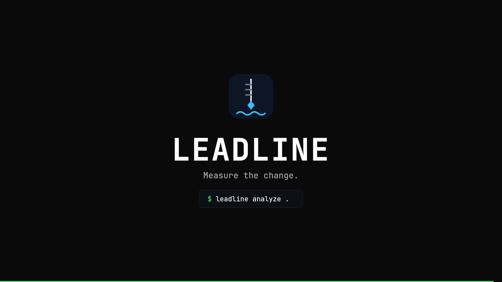
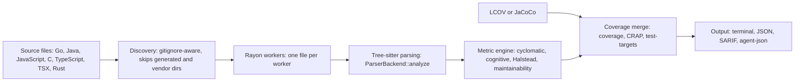
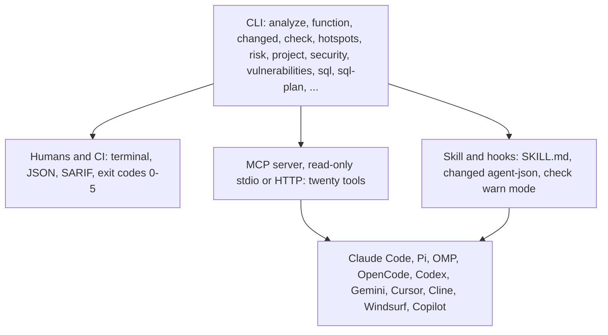
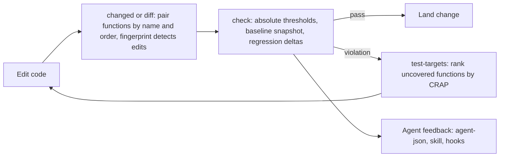

# leadline

<p>
  <a href="https://github.com/jbt95/leadline/actions/workflows/ci.yml"></a>
  <a href="https://github.com/jbt95/leadline/releases"></a>
  
  <a href="LICENSE"></a>
  
</p>

Deterministic function-level complexity analysis for Go, Java, JavaScript, C, TypeScript, TSX, and Rust — a fast feedback loop for humans, CI, and AI coding agents.

`leadline` reports physical and logical LOC, parameters, nesting, cyclomatic and cognitive complexity, Halstead metrics, maintainability, coverage, and CRAP. It parses code with Tree-sitter and never executes it: no build runtime, no network, no project scripts.

<p align="center">
  <a href="assets/leadline-promo.mp4"></a>
</p>

<p align="center">
  <em>▶ <a href="assets/leadline-promo.mp4">Watch Leadline in 30 seconds</a> — an AI agent ships a change, Leadline measures it, the loop iterates.</em>
</p>

## Contents

Start here: [installation](docs/installation.md), [CLI reference](docs/cli-reference.md), [configuration](docs/configuration.md).

Metrics and analysis: [metric specification](docs/metrics.md), [changed code](docs/changed-code.md), [hotspots](docs/hotspots.md), [coupling](docs/coupling.md), [dependencies](docs/dependencies.md), [risk](docs/risk.md), [analytics roadmap](docs/analytics-roadmap.md).

Gates and security: [security findings](docs/security-findings.md), [vulnerabilities](docs/vulnerabilities.md), [security model](docs/security-model.md), [PostgreSQL risks](docs/postgresql-risks.md), [PostgreSQL plans](docs/postgresql-plans.md).

Output and agents: [JSON schema](docs/json-schema.md), [agent integration guide](docs/agent-integration-guide.md), [architecture](docs/architecture.md).

Performance: [benchmarks](docs/benchmark.md), [performance methodology](docs/performance-methodology.md), [real-world benchmarks](docs/realworld-benchmarks.md).

Operating: [troubleshooting](docs/troubleshooting.md), [smoke tests](docs/smoke.md), [versioning](docs/versioning.md), [releasing](docs/releasing.md).

## How it works



## Quick start

Install the latest release (checksum-verified, into `~/.local/bin`):

```console
curl -fsSL https://raw.githubusercontent.com/jbt95/leadline/main/install.sh | sh
leadline analyze .
```

Pin a version with `LEADLINE_VERSION=v0.9.0`, or choose a destination with
`LEADLINE_INSTALL_DIR`. Windows users can download the `.zip` from
[GitHub Releases](https://github.com/jbt95/leadline/releases). Or build from
source with Rust 1.90 or later:

```console
cargo install --path .
```

Release artifacts support macOS ARM64, macOS x86-64, Linux ARM64, Linux x86-64, and Windows x86-64. Update an installed binary in place with `leadline update`; `leadline update --integrations` also refreshes detected Pi, OMP, and Claude Code integrations through each harness's own CLI. See [docs/installation.md](docs/installation.md) for per-OS install blocks, verification, updating, and uninstall.

## AI-agent integration

`leadline` is designed to answer one question after an edit: *did this change improve or degrade maintainability?* Metrics are evidence, not objectives — use them to spot risk, then apply normal engineering judgment.

**Changed-code analysis** keeps the signal small:

```console
leadline changed --base origin/main --format agent-json
```

```json
{"summary": {"changed_functions": 1, "regressions": 1, "improvements": 0},
 "regressions": [{"path": "payment.ts", "function": "processPayment",
   "before": {"cognitive": 12}, "after": {"cognitive": 24}}]}
```

**MCP server** (read-only; stdio by default, HTTP with `--port`; twenty tools: `analyze`, `analyze_changed`, `analyze_function`, `check`, `explain_metric`, `repo_summary`, `test_targets`, `sql_plan`, `security_findings`, `vulnerabilities`, `sql_risks`, `hotspots`, `risk`, `dependencies`, `impact`, `coupling`, `duplication`, `policy`, `debt`, `project`). Its only writes are the opt-in local metrics store ([docs/telemetry.md](docs/telemetry.md)):

```console
leadline mcp
leadline mcp --port 3000
```

A bare `--port` means 3000 (`0` asks the OS for a free port); when the requested port is taken the server picks a free one and prints the actual address to stderr. `GET /health` reports status in HTTP mode.

**Skill and hooks.** Point your harness at the canonical skill in `integrations/common/leadline-skill/SKILL.md`, and run post-edit hooks in warn mode — surface regressions, never fail silently:

```console
leadline changed --format agent-json
leadline check . --cognitive 15 --cyclomatic 10 --max-nesting 4
```

| Harness | Integration |
|---|---|
| Claude Code | Plugin + MCP + skill + hooks (`integrations/claude-code/`) |
| Pi / OMP | Native extension on the shared TS core (`integrations/agent-adapter-ts/`) |
| OpenCode | Plugin (v1; v2 experimental) + MCP |
| Codex, Gemini, Cursor, Cline, Windsurf, Copilot | MCP + skills, rules, or instructions |



See the [agent integration guide](docs/agent-integration-guide.md), the [compatibility matrix](integrations/COMPATIBILITY.md), and [per-harness READMEs](integrations/).

## Analyze

```console
leadline analyze .
leadline analyze . --json
leadline analyze src/payment.ts
leadline analyze . --lcov coverage/lcov.info --json
leadline analyze . --jacoco build/reports/jacoco/test/jacocoTestReport.xml
leadline function src/payment.ts processPayment --json
```

The analyzer reads and parses each file once, with Rayon workers processing files independently. Repository discovery follows `.gitignore`.

Generated and vendor directories are skipped by default; explicitly named files are always analyzed.

JSON output is sorted by path, with functions in source order. `schema_version`, `analyzer_version`, and `metric_specs` mark output compatibility, and each file carries deterministic `parse_errors`.

## Quality gates

```console
leadline check . --cognitive 15 --cyclomatic 10 --max-nesting 4
leadline check . --crap 30 --lcov coverage/lcov.info --json
```

Thresholds fail only when a value exceeds its limit. A CRAP threshold also fails when coverage is unavailable. Thresholds can live in `leadline.toml` instead of flags; CLI flags win.

Gate PostgreSQL plan regressions from checked-in `EXPLAIN` artifacts (never a database connection):

```console
leadline sql-plan --current plans/current --baseline plans/baseline --max-cost-increase-percent 25
```
Gate vulnerable dependencies with changed-import evidence (never queries registries):

```console
leadline vulnerabilities . --osv osv.json --fail-on-severity high
```

Flag static PostgreSQL risks without executing SQL:

```console
leadline sql . --fail-on-severity high
```

Gate scanner findings with code context (never runs scanners):

```console
leadline security . --sarif findings.sarif --fail-on-severity high --new-only
```

Stop staged or agent-produced secrets before they leave the loop (delegates to
installed `gitleaks`, always redacted):

```console
cp integrations/git-hooks/pre-commit .git/hooks/pre-commit
```

For refactors without useful Git history, pin a snapshot and gate against it:

```console
leadline baseline . --output .leadline-baseline.json
leadline check . --baseline .leadline-baseline.json --regressions
```



Exit codes are stable:

- `0`: analysis succeeded, or a quality gate passed.
- `1`: a quality gate found metric violations or source parse errors.
- `2`: usage or config error (unknown flag, missing threshold, bad path, invalid `leadline.toml`).
- `3`: incomplete analysis (no supported files, Git failure, unreadable input).
- `4`: report input error (unreadable or unparsable LCOV / JaCoCo, SARIF, OSV / Trivy, SQL, or `EXPLAIN` JSON).
- `5`: internal error.

See the [CLI reference](docs/cli-reference.md), [JSON schema](docs/json-schema.md),
and [configuration](docs/configuration.md).

## Changed functions

```console
leadline changed --base origin/main --json
leadline diff HEAD~1
```

Functions are paired by name and same-name source order. By default a rename surfaces as one removal plus one addition; pass `--renames` to pair Git-detected file renames instead.

`--format agent-json` emits the compact agent-oriented shape on `analyze`, `function`,
`check`, `changed`, `diff`, `hotspots`, `risk`, `coupling`, `dependencies`, `impact`,
`test-targets`, `project`, `debt`, `sql-plan`, `security`, `vulnerabilities`, and `sql`. `leadline doctor` self-checks the parsers, coverage
readers, `git`, and `leadline.toml`. `leadline version` prints the release version.

## Git history and hotspots

```console
leadline hotspots
leadline hotspots --limit 20 --since 30d
leadline hotspots src/payment --json
leadline hotspots . --lcov coverage/lcov.info --format agent-json
```

Hotspots rank files by `max cognitive complexity x changes in the selected window`
(model `complexity-x-churn`) and keep every dimension next to the score: cognitive
and cyclomatic complexity, CRAP, coverage, churn windows, lines added/deleted, days
since the last change, and contributor counts. Git history is read with one streamed
`git log --relative` walk; recency windows are relative to the HEAD commit time, so
the same snapshot produces the same report on any day. Renames resolve newest to
oldest, so moved files keep their history.

A directory outside a Git repository, a machine without `git`, or an unborn HEAD
still ranks by complexity and reports `git_available: false` with `null` churn
fields. Merge commits are excluded. See [hotspots](docs/hotspots.md) for formulas,
limitations, and the ethical guardrail: commit and ownership signals must never rank
developers. The [analytics roadmap](docs/analytics-roadmap.md) describes the ownership
and static-report milestones still to build on this foundation
(coupling, dependencies, impact, and risk are implemented; see above and below).

Build the canonical project model and compare complete states before editing:

```console
leadline project . --json
leadline debt --base HEAD~1 --fail-on-regression
leadline snapshot . --output trends.json
```

`project` joins every analytics section (dependencies, churn, coupling,
ownership, duplication, policy, risk) into one deterministic document; `debt`
classifies threshold transitions and risk deltas between complete repository
states; `snapshot` appends one HEAD-keyed trend point. The static web report is
not built yet.

Find files that repeatedly change together even when no import connects them:

```console
leadline coupling src/payment/PaymentService.ts
leadline coupling src/payment/PaymentService.ts --min-cochanges 1 --format agent-json
```

Coupling reports co-change counts, directional coupling, and Jaccard similarity
from the same history walk. Commits wider than 50 files never create pairs, and
co-change is process evidence to inspect, not a dependency to trust — see
[coupling](docs/coupling.md).

Map static dependencies and blast radius before editing:

```console
leadline dependencies
leadline impact src/payment/PaymentService.ts --format agent-json
```

`dependencies` reports file-level edges (source imports target), fan-in
(direct importers), fan-out (resolved imports), and import cycles. `impact`
lists the transitive dependents of one file with distances, direct-dependent
counts, and blast radius. Resolution is deliberately conservative: only
relative JS/TS imports, exact Java type imports, and file-relative Rust
`mod` declarations produce edges. Bare package imports, Go module-qualified
imports, Java wildcards, and Rust `use` paths produce none. The graph is
therefore static evidence to inspect, not proof of runtime behavior; see
[dependencies](docs/dependencies.md).

Rank change risk before editing:

```console
leadline risk --format agent-json
```

`risk` scores each file with the explainable `change-risk` model
(complexity, CRAP, churn, impact, ownership, policy — weights and formulas in
[docs/risk.md](docs/risk.md)). Unknown components stay `null` and the score
renormalizes over what is known. It is informational only (exit `0`); never
use it to rank developers.

## Coverage limits

LCOV and JaCoCo line coverage are supported, with Windows and Unix report paths normalized.

Coverage mixes line and branch data Sonar-style: a function ratio is
(covered lines + covered branches) / (known lines + known branches) over its
range; reports without branch records (`BRDA`/`mb`+`cb`) keep exact line-only
ratios. A decision line counts as covered with any positive hit count,
uncovered with a known zero, and unknown when the record names no such line. `leadline test-targets PATH --coverage
FILE` (or the read-only MCP `test_targets` tool, which requires `coverage`)
ranks functions holding known-zero-hit decision lines by CRAP; unknown lines
are reported separately, never as uncovered:

```console
leadline test-targets src/payment.ts --coverage coverage/lcov.info
```

When a coverage path could match more than one file, leadline reports no coverage rather than guess. Nested functions can share covered lines.

Source maps and Cobertura are not supported.

## Local metrics (opt-in)

Set `LEADLINE_METRICS_DIR` to a local directory and every CLI invocation and
MCP tool call updates a bounded local metrics store plus a Prometheus text
file that Grafana Alloy's textfile collector can scrape. Counters, durations,
and fixed labels only: nothing is sent over the network, and no path,
argument, finding, or identity is recorded. See
[docs/telemetry.md](docs/telemetry.md).

## Development

```console
cargo fmt --check
cargo clippy --offline --all-targets --locked -- -D warnings
cargo test --offline --locked
cargo bench --bench analyzer
cargo bench --bench history
```

See [architecture](docs/architecture.md), [`default` metric rules](docs/metrics.md),
[benchmark instructions](docs/benchmark.md), [changed-code semantics](docs/changed-code.md),
[benchmark methodology](docs/performance-methodology.md), [troubleshooting](docs/troubleshooting.md),
the [security model](docs/security-model.md), [versioning](docs/versioning.md),
[releasing](docs/releasing.md), and the [smoke suite](docs/smoke.md).
