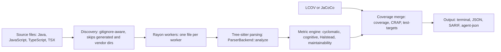
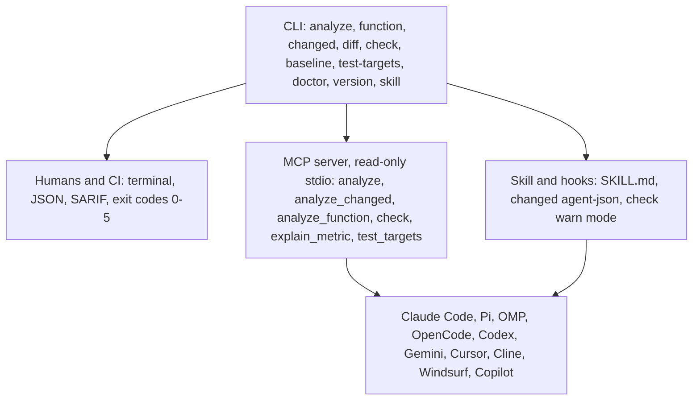
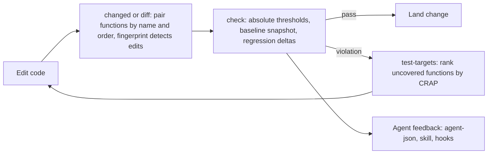

# leadline

<p align="center">
  
</p>

<p>
  <a href="https://github.com/jbt95/leadline/actions/workflows/ci.yml"></a>
  <a href="https://github.com/jbt95/leadline/releases"></a>
  
  <a href="LICENSE"></a>
  
</p>

Deterministic function-level complexity analysis for Java, JavaScript, TypeScript, and TSX — a fast feedback loop for humans, CI, and AI coding agents.

`leadline` reports physical and logical LOC, parameters, nesting, cyclomatic and cognitive complexity, Halstead metrics, maintainability, coverage, and CRAP. It parses code with Tree-sitter and never executes it: no build runtime, no network, no project scripts.

## How it works



## Quick start

Install the latest release (checksum-verified, into `~/.local/bin`):

```console
curl -fsSL https://raw.githubusercontent.com/jbt95/leadline/main/install.sh | sh
leadline analyze .
```

Pin a version with `LEADLINE_VERSION=v0.1.0`, or choose a destination with
`LEADLINE_INSTALL_DIR`. Windows users can download the `.zip` from
[GitHub Releases](https://github.com/jbt95/leadline/releases). Or build from
source with Rust 1.90 or later:

```console
cargo install --path .
```

Release artifacts support macOS ARM64, macOS x86-64, Linux ARM64, Linux x86-64, and Windows x86-64.

## AI-agent integration

`leadline` is designed to answer one question after an edit: *did this change improve or degrade maintainability?* Metrics are evidence, not objectives — use them to spot risk, then apply normal engineering judgment.

**Changed-code analysis** keeps the signal small:

```console
leadline changed --base origin/main --format agent-json
```

```json
{"summary": {"changed_functions": 1, "regressions": 1, "improvements": 0},
 "regressions": [{"path": "payment.ts", "function": "processPayment",
   "before": {"cognitive": 12}, "after": {"cognitive": 24}}]}
```

**MCP server** (read-only, stdio, seven tools: `analyze`, `analyze_changed`, `analyze_function`, `check`, `explain_metric`, `repo_summary`, `test_targets`):

```console
leadline mcp
```

**Skill and hooks.** Point your harness at the canonical skill in `integrations/common/leadline-skill/SKILL.md`, and run post-edit hooks in warn mode — surface regressions, never fail silently:

```console
leadline changed --format agent-json
leadline check . --cognitive 15 --cyclomatic 10 --max-nesting 4
```

| Harness | Integration |
|---|---|
| Claude Code | Plugin + MCP + skill + hooks (`integrations/claude-code/`) |
| Pi / OMP | Native extension on the shared TS core (`integrations/agent-adapter-ts/`) |
| OpenCode | Plugin (v1; v2 experimental) + MCP |
| Codex, Gemini, Cursor, Cline, Windsurf, Copilot | MCP + skills, rules, or instructions |



See the [agent integration guide](docs/agent-integration-guide.md), the [compatibility matrix](integrations/COMPATIBILITY.md), and [per-harness READMEs](integrations/).

## Analyze

```console
leadline analyze .
leadline analyze . --json
leadline analyze src/payment.ts
leadline analyze . --lcov coverage/lcov.info --json
leadline analyze . --jacoco build/reports/jacoco/test/jacocoTestReport.xml
leadline function src/payment.ts processPayment --json
```

The analyzer reads and parses each file once, with Rayon workers processing files independently. Repository discovery follows `.gitignore`.

Generated and vendor directories are skipped by default; explicitly named files are always analyzed.

JSON output is sorted by path, with functions in source order. `schema_version`, `analyzer_version`, and `metric_specs` mark output compatibility, and each file carries deterministic `parse_errors`.

## Quality gates

```console
leadline check . --cognitive 15 --cyclomatic 10 --max-nesting 4
leadline check . --crap 30 --lcov coverage/lcov.info --json
```

Thresholds fail only when a value exceeds its limit. A CRAP threshold also fails when coverage is unavailable. Thresholds can live in `leadline.toml` instead of flags; CLI flags win.

For refactors without useful Git history, pin a snapshot and gate against it:

```console
leadline baseline . --output .leadline-baseline.json
leadline check . --baseline .leadline-baseline.json --regressions
```



Exit codes are stable:

- `0`: analysis succeeded, or a quality gate passed.
- `1`: a quality gate found metric violations or source parse errors.
- `2`: usage or config error (unknown flag, missing threshold, bad path, invalid `leadline.toml`).
- `3`: incomplete analysis (no supported files, Git failure, unreadable input).
- `4`: coverage input error (unreadable or unparsable LCOV / JaCoCo file).
- `5`: internal error.

See the [CLI reference](docs/cli-reference.md), [JSON schema](docs/json-schema.md),
and [configuration](docs/configuration.md).

## Changed functions

```console
leadline changed --base origin/main --json
leadline diff HEAD~1
```

Functions are paired by name and same-name source order. By default a rename surfaces as one removal plus one addition; pass `--renames` to pair Git-detected file renames instead.

`--format agent-json` emits the compact agent-oriented shape on `analyze`, `function`,
`check`, `changed`, `diff`, and `test-targets`. `leadline doctor` self-checks the parsers, coverage
readers, `git`, and `leadline.toml`. `leadline version` prints the release version.

## Coverage limits

LCOV and JaCoCo line coverage are supported, with Windows and Unix report paths normalized.

Coverage is line coverage, never branch coverage: a decision line counts as
covered with any positive hit count, uncovered with a known zero, and unknown
when the record names no such line. `leadline test-targets PATH --coverage
FILE` (or the read-only MCP `test_targets` tool, which requires `coverage`)
ranks functions holding known-zero-hit decision lines by CRAP; unknown lines
are reported separately, never as uncovered:

```console
leadline test-targets src/payment.ts --coverage coverage/lcov.info
```

When a coverage path could match more than one file, leadline reports no coverage rather than guess. Nested functions can share covered lines.

Source maps and Cobertura are not supported.

## Development

```console
cargo fmt --check
cargo clippy --all-targets --locked -- -D warnings
cargo test --locked
cargo bench --bench analyzer
```

See [architecture](docs/architecture.md), [`default-v1` metric rules](docs/metrics.md), and [benchmark instructions](docs/benchmark.md).
